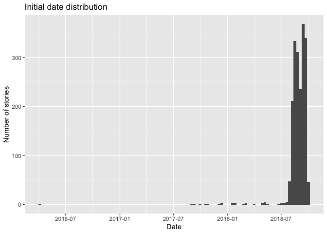
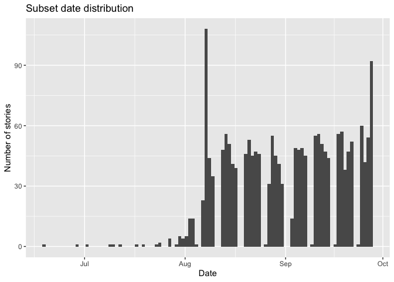
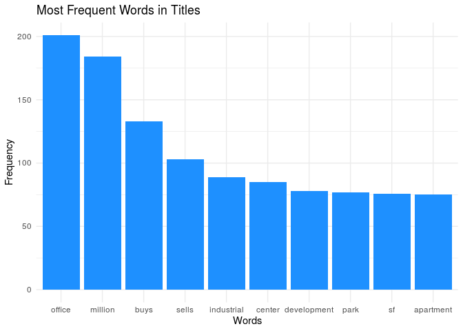
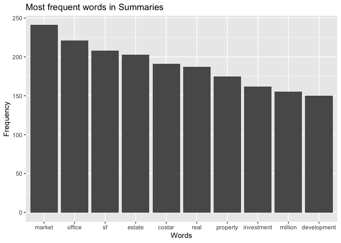
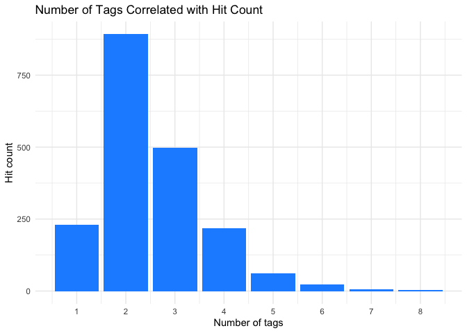
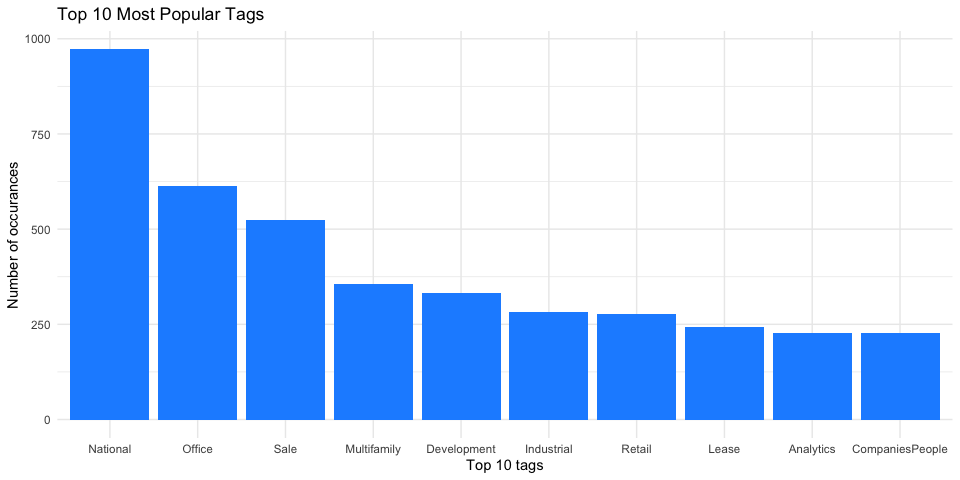
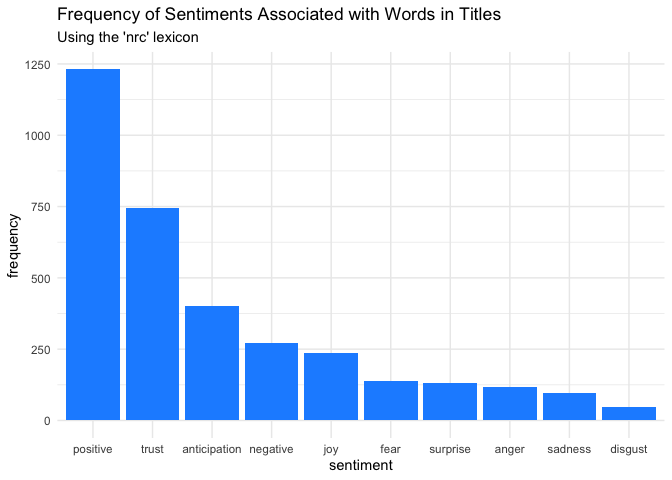

Initial data exploration
================
Margaret Reed, Daniel Hwang, Yi Chen
Oct 12, 2019

[About](./about.html) [Application](./app.html)

``` r
data <- read.csv("data.csv") %>%
  as_tibble()
```

We needed to clean the data a little. We did so by coding the date
variable as a date using the lubridate package. We also did some
reordering and converting of times for ease of analysis.

``` r
data <- data %>%
  mutate(dateTime = ymd_hms(CreatedDate),
         Year = year(dateTime),
         Month = month(dateTime),
         Day = day(dateTime),
         Date = paste(Year, Month, Day, col = "-") %>% ymd() %>% as.Date()) %>%
  select(-dateTime, -Day, -Month, -Year) %>%
  select(Date, everything()) %>%
  mutate(Title = as.character(Title), 
         Summary = as.character(Summary),
         Body = as.character(Body))
```

Here is our first exploratory visualization, looking at the distribution
of the dates each story was created.

``` r
data %>%
  ggplot(aes(x = Date)) +
  geom_histogram(bins = 100) +
  labs(x = "Date", y = "Number of stories", title = "Initial date distribution")
```

<!-- -->

We decided we wanted to look more closely at the dates in the latter
half of 2018.

``` r
data %>%
  filter(Date >= "2018-06-01") %>%
  ggplot(aes(x = Date)) +
  geom_histogram(bins = 100) +
  labs(x = "Date", y = "Number of stories", title = "Subset date distribution")
```

<!-- -->

Here is a visualization of the most common words in the titles overall.

``` r
textFreq <- data %>%
  select(Date, Title, StoryID) %>%
  unnest_tokens(word, Title) %>%
  anti_join(stop_words) %>%
  count(word, sort = TRUE)
```

    ## Joining, by = "word"

``` r
textFreq$word <- factor(textFreq$word, levels = textFreq$word[order(desc((textFreq$n)))])

textFreq %>%
  filter(n>= 75) %>%
  ggplot(aes(x = word, y = n)) +
    geom_col() +
  labs(x = "Words", y = "Frequency", title = "Most frequent words in Titles")
```

<!-- -->

Here is a visualization of the most common words in summaries overall.

``` r
textFreq <- data %>%
  select(Date, Summary, StoryID) %>%
  unnest_tokens(word, Summary) %>%
  anti_join(stop_words) %>%
  count(word, sort = TRUE)
```

    ## Joining, by = "word"

``` r
textFreq$word <- factor(textFreq$word, levels = textFreq$word[order(desc((textFreq$n)))])

textFreq %>%
  filter(n>= 150) %>%
  ggplot(aes(x = word, y = n)) +
    geom_col() +
  labs(x = "Words", y = "Frequency", title = "Most frequent words in Summaries")
```

<!-- -->

Here we are sub-setting the data by countries.

``` r
dataUSA <- subset(data, Country_USA == 1)
dataGBR <- subset(data, Country_GBR == 1)
dataCAN <- subset(data, Country_CAN == 1)

dataUSA %>%
  select(Title, Hits)
```

    ## # A tibble: 1,251 x 2
    ##    Title                                                               Hits
    ##    <chr>                                                              <int>
    ##  1 Paramount Transportation Leases 136,000-SF Cheverly Facility           0
    ##  2 Newmark Knight Frank Boosts National Appraisal Platform with Deal…    32
    ##  3 Amazon Outgrows Seattle: Opens Search for Second HQ City in North…    71
    ##  4 For Amazon’s Second HQ’s Search, Bigger May Be Better                601
    ##  5 Last Call for Amazon HQ2: Today is Deadline for Communities to Su…  1379
    ##  6 Hundreds of Localities Fortify Their Amazon HQ2 Bids with Hefty F…  1623
    ##  7 Implications of a Tight Office Market and Amazon’s HQ2                27
    ##  8 Amazon Narrows HQ2 Search to 20 Markets                             5149
    ##  9 L.A. Officials ‘Thrilled’ by Amazon HQ2 Short List                   275
    ## 10 Denver Makes Shortlist for Amazon HQ2                                134
    ## # … with 1,241 more rows

We decided to add up the number of tags each story had associated with
it.

``` r
# condenses tags into one tags column and their boolean into hasTag
allTags <- gather(data, "tags", "hasTag", 13:35) 
allTags <- allTags[order(allTags$StoryID),]

# to find all tags associated with an article, filter for hasTag is true
allTags %>%
  filter(StoryID == 184098 & hasTag == 1) %>%
  select(Title, Date, tags)
```

    ## # A tibble: 6 x 3
    ##   Title                                            Date       tags         
    ##   <chr>                                            <date>     <chr>        
    ## 1 Hundreds of Localities Fortify Their Amazon HQ2… 2017-10-26 Tag_National 
    ## 2 Hundreds of Localities Fortify Their Amazon HQ2… 2017-10-26 Tag_Office   
    ## 3 Hundreds of Localities Fortify Their Amazon HQ2… 2017-10-26 Tag_Developm…
    ## 4 Hundreds of Localities Fortify Their Amazon HQ2… 2017-10-26 Tag_Finance  
    ## 5 Hundreds of Localities Fortify Their Amazon HQ2… 2017-10-26 Tag_Company  
    ## 6 Hundreds of Localities Fortify Their Amazon HQ2… 2017-10-26 Tag_Companie…

``` r
# creates a dataframe with story titles and their tag counts
tagCounts <- allTags %>%
  group_by(StoryID) %>%
  count(hasTag == 1) %>%
  select(StoryID, n) %>%
  rename(numTags = n)

# previous operation returns both true and false, removing all FALSE
toDelete <- seq(1, nrow(tagCounts), 2)
tagCounts <- tagCounts[-toDelete, ]

data <- data %>%
  full_join(tagCounts)
```

    ## Joining, by = "StoryID"

Here is a plot of the number of tags associated with a story and how
many hits it got.

``` r
# correlating number of tags with hit count
data %>%
  select(Hits, numTags) %>%
  ggplot(aes(numTags)) + 
  geom_bar(fill = "Blue") + 
  scale_x_continuous(name = "Number of tags", breaks = seq(0, 8, 1)) +
  scale_y_continuous(name = "Hit count") + 
  theme_minimal() + 
  labs(title = "Number of Tags Correlated with Hit Count")
```

<!-- -->

We also decided to visualize the frequency of tags in general.

``` r
tagPop <- allTags %>%
  count(tags, hasTag) 

tagPop <- tagPop %>%
  filter(hasTag == 1) %>%
  arrange(n) %>%
  select(tags, n) %>%
  rename(total = n)

tagPop <- mutate_if(tagPop, 
                is.character, 
                str_replace_all, pattern = "Tag_", replacement = "")


tagPop %>%
  arrange(desc(total)) %>%
  slice(0:10) %>%
  ggplot(aes(x = reorder(tags, -total), y = total)) +
  geom_col(fill = "Blue") + 
  scale_x_discrete(name = "Top 10 tags") +
  scale_y_continuous(name = "# of stories with tag") + 
  theme_minimal() + 
  labs(title = "Top 10 Most Popular Tags")
```

<!-- -->

Here is a very basic multivariate linear regression model just for
fun:’)

``` r
data1 <- data %>%
  drop_na()

first_model <- lm(Hits ~ data1$numTags + Date + AuthorID + Country_USA + Country_CAN + Country_GBR + data1$Tag_None + data1$Tag_National + data1$Tag_Office + data1$Tag_Industrial + data1$Tag_Retail + data1$Tag_People + data1$Tag_Investment + data1$Tag_Analytics + data1$Tag_Development + data1$Tag_Finance + data1$Tag_Multifamily + data1$Tag_Hospitality + data1$Tag_Company + data1$Tag_Healthcare + data1$Tag_CompaniesPeople + data1$Tag_Lease + data1$Tag_Sale + data1$Tag_MixedUse + data1$Tag_SpecialPurpose, data = data1)

tidy(first_model)
```

    ## # A tibble: 25 x 5
    ##    term                 estimate std.error statistic  p.value
    ##    <chr>                   <dbl>     <dbl>     <dbl>    <dbl>
    ##  1 (Intercept)          5628.    2667.          2.11 3.49e- 2
    ##  2 data1$numTags         115.      30.2         3.81 1.45e- 4
    ##  3 Date                   -0.353    0.150      -2.35 1.88e- 2
    ##  4 AuthorID                0.157    0.0665      2.36 1.82e- 2
    ##  5 Country_USA           737.      59.4        12.4  5.07e-34
    ##  6 Country_CAN           497.      47.2        10.5  2.91e-25
    ##  7 Country_GBR           201.      64.9         3.09 2.00e- 3
    ##  8 data1$Tag_National    312.      35.4         8.80 3.01e-18
    ##  9 data1$Tag_Office      -64.1     32.5        -1.97 4.86e- 2
    ## 10 data1$Tag_Industrial -134.      34.4        -3.88 1.06e- 4
    ## # … with 15 more rows

``` r
glance(first_model)
```

    ## # A tibble: 1 x 11
    ##   r.squared adj.r.squared sigma statistic   p.value    df  logLik    AIC
    ##       <dbl>         <dbl> <dbl>     <dbl>     <dbl> <int>   <dbl>  <dbl>
    ## 1     0.475         0.469  242.      72.0 2.49e-246    25 -13344. 26740.
    ## # … with 3 more variables: BIC <dbl>, deviance <dbl>, df.residual <int>

Here we also did a little sentiment analysis for fun :’’)

``` r
textDataFreq <- data %>%
  select(Date, Title, StoryID) %>%
  unnest_tokens(word, Title) %>%
  inner_join(nrc) %>%
  group_by(sentiment) %>%
  summarize(totSents = n()) %>%
  arrange(desc(totSents))
```

    ## Joining, by = "word"

``` r
textDataFreq$sentiment <- factor(textDataFreq$sentiment, levels = textDataFreq$sentiment[order(desc((textDataFreq$totSents)))])

textDataFreq %>%
  ggplot(aes(x = sentiment, y = totSents)) +
  geom_col() + 
  labs(x = "sentiment", y = "frequency", title = "Frequency of sentiments associated with words in titles", subtitle = "Using the 'nrc' lexicon")
```

<!-- -->
