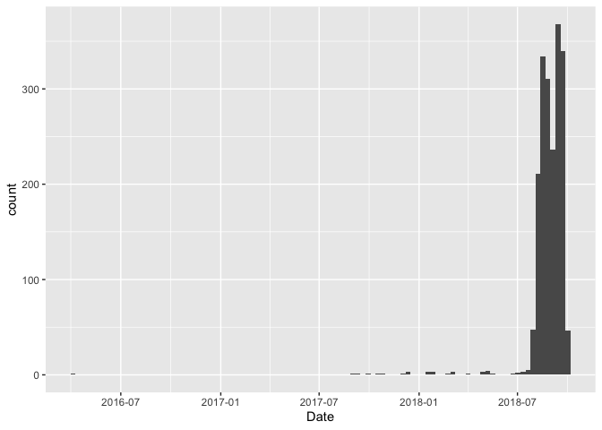
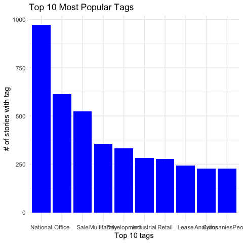

Initial data exploration
================
Margaret Reed, Daniel Hwang, Yi Chen
Oct 12, 2019

``` r
library(tidyverse)
```

    ## ── Attaching packages ────────────────────────────────────────────────────────────────────────────────────────────── tidyverse 1.2.1 ──

    ## ✔ ggplot2 3.2.1     ✔ purrr   0.3.2
    ## ✔ tibble  2.1.3     ✔ dplyr   0.8.3
    ## ✔ tidyr   1.0.0     ✔ stringr 1.4.0
    ## ✔ readr   1.3.1     ✔ forcats 0.4.0

    ## ── Conflicts ───────────────────────────────────────────────────────────────────────────────────────────────── tidyverse_conflicts() ──
    ## ✖ dplyr::filter() masks stats::filter()
    ## ✖ dplyr::lag()    masks stats::lag()

``` r
library(broom)
library(dplyr)
library(lubridate)
```

    ## 
    ## Attaching package: 'lubridate'

    ## The following object is masked from 'package:base':
    ## 
    ##     date

``` r
library(stringr)
library(tidytext)
library(textdata)
library(SnowballC)


data(stop_words)
afinn <- get_sentiments("afinn")
bing <- get_sentiments("bing")
nrc <- get_sentiments("nrc")
```

``` r
data <- read.csv("data.csv") %>%
  as_tibble()
```

``` r
data <- data %>%
  mutate(dateTime = ymd_hms(CreatedDate),
         Year = year(dateTime),
         Month = month(dateTime),
         Day = day(dateTime),
         Date = paste(Year, Month, Day, col = "-") %>% ymd() %>% as.Date()) %>%
  select(-dateTime, -Day, -Month, -Year) %>%
  select(Date, everything()) %>%
  mutate(Title = as.character(Title), 
         Summary = as.character(Summary),
         Body = as.character(Body))
```

``` r
data %>%
  ggplot(aes(x = Date)) +
  geom_histogram(bins = 100)
```

<!-- -->

``` r
smallData <- data %>%
  slice(1:20)
```

``` r
textSmallData <- smallData %>%
  select(Date, Title, StoryID) %>%
  unnest_tokens(word, Title)

textFreq <- data %>%
  select(Date, Title, StoryID) %>%
  unnest_tokens(word, Title) %>%
  anti_join(stop_words) %>%
  count(word, sort = TRUE)
```

    ## Joining, by = "word"

``` r
textFreq %>%
  filter(n>= 100) %>%
  ggplot(aes(x = word, y = n)) +
    geom_col()
```

<!-- -->

``` r
bing <- bing %>%
  mutate(sentValue = case_when(
    sentiment == "negative" ~ -1,
    sentiment == "positive" ~ 1
  ))
```

``` r
textData <- data %>%
  select(Date, Title, StoryID) %>%
  unnest_tokens(word, Title) %>%
  inner_join(nrc) # %>%
```

    ## Joining, by = "word"

``` r
  # group_by(StoryID) %>%
  # summarize(meanSent = mean(value),
  #           tot_words = n())
```

``` r
# hitsSentData <- full_join(data, textData) %>%
#   select(StoryID, Hits, meanSent) %>%
#   drop_na()
# 
# hitsSentData %>%
#   ggplot(aes(x = meanSent, y = Hits)) +
#   geom_point()
```

``` r
dataUSA <- subset(data, Country_USA == 1)
dataGBR <- subset(data, Country_GBR == 1)
dataCAN <- subset(data, Country_CAN == 1)

dataUSA %>%
  select(Title, Hits)
```

    ## # A tibble: 1,251 x 2
    ##    Title                                                               Hits
    ##    <chr>                                                              <int>
    ##  1 Paramount Transportation Leases 136,000-SF Cheverly Facility           0
    ##  2 Newmark Knight Frank Boosts National Appraisal Platform with Deal…    32
    ##  3 Amazon Outgrows Seattle: Opens Search for Second HQ City in North…    71
    ##  4 For Amazon’s Second HQ’s Search, Bigger May Be Better                601
    ##  5 Last Call for Amazon HQ2: Today is Deadline for Communities to Su…  1379
    ##  6 Hundreds of Localities Fortify Their Amazon HQ2 Bids with Hefty F…  1623
    ##  7 Implications of a Tight Office Market and Amazon’s HQ2                27
    ##  8 Amazon Narrows HQ2 Search to 20 Markets                             5149
    ##  9 L.A. Officials ‘Thrilled’ by Amazon HQ2 Short List                   275
    ## 10 Denver Makes Shortlist for Amazon HQ2                                134
    ## # … with 1,241 more rows

``` r
gatheredData <- data %>%
  pivot_longer(Tag_None:Tag_CoStarGreenReport, names_to = "Tags") 
```

``` r
# condenses tags into one tags column and their boolean into hasTag
allTags <- gather(data, "tags", "hasTag", 13:35) 
allTags <- allTags[order(allTags$StoryID),]

# to find all tags associated with an article, filter for hasTag is true
allTags %>%
  filter(StoryID == 184098 & hasTag == 1) %>%
  select(Title, tags)
```

    ## # A tibble: 6 x 2
    ##   Title                                                     tags           
    ##   <chr>                                                     <chr>          
    ## 1 Hundreds of Localities Fortify Their Amazon HQ2 Bids wit… Tag_National   
    ## 2 Hundreds of Localities Fortify Their Amazon HQ2 Bids wit… Tag_Office     
    ## 3 Hundreds of Localities Fortify Their Amazon HQ2 Bids wit… Tag_Development
    ## 4 Hundreds of Localities Fortify Their Amazon HQ2 Bids wit… Tag_Finance    
    ## 5 Hundreds of Localities Fortify Their Amazon HQ2 Bids wit… Tag_Company    
    ## 6 Hundreds of Localities Fortify Their Amazon HQ2 Bids wit… Tag_CompaniesP…

``` r
# creates a dataframe with story titles and their tag counts
tagCounts <- allTags %>%
  group_by(StoryID) %>%
  count(hasTag == 1) %>%
  select(StoryID, n) %>%
  rename(numTags = n)

# previous operation returns both true and false, removing all FALSE
toDelete <- seq(1, nrow(tagCounts), 2)
tagCounts <- tagCounts[-toDelete, ]

data <- data %>%
  full_join(tagCounts)
```

    ## Joining, by = "StoryID"

``` r
# correlating number of tags with hit count
data %>%
  select(Hits, numTags) %>%
  ggplot(aes(numTags)) + 
  geom_bar(fill = "Blue") + 
  scale_x_continuous(name = "Number of tags", breaks = seq(0, 8, 1)) +
  scale_y_continuous(name = "Hit count") + 
  theme_minimal() + 
  labs(title = "Number of Tags Correlated with Hit Count")
```

<!-- -->

``` r
# --------------------------------Now plotting by tag popularity

tagPop <- allTags %>%
  count(tags, hasTag) 

tagPop <- tagPop %>%
  filter(hasTag == 1) %>%
  arrange(n) %>%
  select(tags, n) %>%
  rename(total = n)

tagPop <- mutate_if(tagPop, 
                is.character, 
                str_replace_all, pattern = "Tag_", replacement = "")


tagPop %>%
  arrange(desc(total)) %>%
  slice(0:10) %>%
  ggplot(aes(x = reorder(tags, -total), y = total)) +
  geom_col(fill = "Blue") + 
  scale_x_discrete(name = "Top 10 tags") +
  scale_y_continuous(name = "# of stories with tag") + 
  theme_minimal() + 
  labs(title = "Top 10 Most Popular Tags")
```

<!-- -->

``` r
data %>%
  arrange(Date)
```

    ## # A tibble: 1,933 x 36
    ##    Date       StoryID Title Summary Body   Hits AuthorID CreatedDate
    ##    <date>       <int> <chr> <chr>   <chr> <int>    <int> <fct>      
    ##  1 2016-03-31  146316 Para… Will O… Wash…     0      132 2016-03-31…
    ##  2 2017-09-05  182305 Newm… Exclus… "New…    32      296 2017-09-05…
    ##  3 2017-09-07  182389 Amaz… Tech G… "Ama…    71      240 2017-09-07…
    ##  4 2017-09-28  183158 For … Bigges… "Whi…   601      240 2017-09-28…
    ##  5 2017-10-19  183882 Last… Hundre… "Tod…  1379      240 2017-10-19…
    ##  6 2017-10-26  184098 Hund… While … "<sp…  1623      240 2017-10-26…
    ##  7 2017-12-04  185294 Impl… With E… "Sin…    27      157 2017-12-04…
    ##  8 2017-12-08  194529 Colu… Surgin… "A r…     1       38 2017-12-08…
    ##  9 2017-12-08  194530 "Rel… Roughl… "New…     0      113 2017-12-08…
    ## 10 2017-12-13  194528 "Day… "Cycle… "Day…     0      312 2017-12-13…
    ## # … with 1,923 more rows, and 28 more variables: Country_USA <int>,
    ## #   Country_CAN <int>, Country_GBR <int>, Tag_None <int>,
    ## #   Tag_National <int>, Tag_Office <int>, Tag_Industrial <int>,
    ## #   Tag_Retail <int>, Tag_People <int>, Tag_Investment <int>,
    ## #   Tag_Analytics <int>, Tag_Development <int>, Tag_Finance <int>,
    ## #   Tag_Events <int>, Tag_Multifamily <int>, Tag_Hospitality <int>,
    ## #   Tag_Company <int>, Tag_Healthcare <int>, Tag_Legal <int>,
    ## #   Tag_Land <int>, Tag_Lease <int>, Tag_Sale <int>, Tag_MixedUse <int>,
    ## #   Tag_SpecialPurpose <int>, Tag_PublicSector <int>,
    ## #   Tag_CompaniesPeople <int>, Tag_CoStarGreenReport <int>, numTags <int>

``` r
data1 <- data %>%
  drop_na()

first_model <- lm(Hits ~ data1$numTags + Date + AuthorID + Country_USA + Country_CAN + Country_GBR + data1$Tag_None + data1$Tag_National + data1$Tag_Office + data1$Tag_Industrial + data1$Tag_Retail + data1$Tag_People + data1$Tag_Investment + data1$Tag_Analytics + data1$Tag_Development + data1$Tag_Finance + data1$Tag_Multifamily + data1$Tag_Hospitality + data1$Tag_Company + data1$Tag_Healthcare + data1$Tag_CompaniesPeople + data1$Tag_Lease + data1$Tag_Sale + data1$Tag_MixedUse + data1$Tag_SpecialPurpose, data = data1)

tidy(first_model)
```

    ## # A tibble: 25 x 5
    ##    term                 estimate std.error statistic  p.value
    ##    <chr>                   <dbl>     <dbl>     <dbl>    <dbl>
    ##  1 (Intercept)          5628.    2667.          2.11 3.49e- 2
    ##  2 data1$numTags         115.      30.2         3.81 1.45e- 4
    ##  3 Date                   -0.353    0.150      -2.35 1.88e- 2
    ##  4 AuthorID                0.157    0.0665      2.36 1.82e- 2
    ##  5 Country_USA           737.      59.4        12.4  5.07e-34
    ##  6 Country_CAN           497.      47.2        10.5  2.91e-25
    ##  7 Country_GBR           201.      64.9         3.09 2.00e- 3
    ##  8 data1$Tag_National    312.      35.4         8.80 3.01e-18
    ##  9 data1$Tag_Office      -64.1     32.5        -1.97 4.86e- 2
    ## 10 data1$Tag_Industrial -134.      34.4        -3.88 1.06e- 4
    ## # … with 15 more rows

``` r
glance(first_model)
```

    ## # A tibble: 1 x 11
    ##   r.squared adj.r.squared sigma statistic   p.value    df  logLik    AIC
    ##       <dbl>         <dbl> <dbl>     <dbl>     <dbl> <int>   <dbl>  <dbl>
    ## 1     0.475         0.469  242.      72.0 2.49e-246    25 -13344. 26740.
    ## # … with 3 more variables: BIC <dbl>, deviance <dbl>, df.residual <int>

``` r
tagPop %>%
  select(tags) %>%
  pull()
```

    ##  [1] "Events"          "PublicSector"    "Healthcare"     
    ##  [4] "Land"            "Legal"           "SpecialPurpose" 
    ##  [7] "MixedUse"        "Company"         "Investment"     
    ## [10] "Hospitality"     "People"          "Finance"        
    ## [13] "Analytics"       "CompaniesPeople" "Lease"          
    ## [16] "Retail"          "Industrial"      "Development"    
    ## [19] "Multifamily"     "Sale"            "Office"         
    ## [22] "National"
